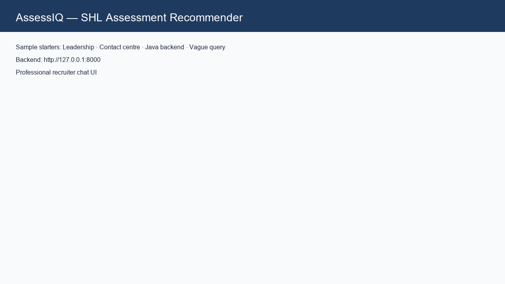
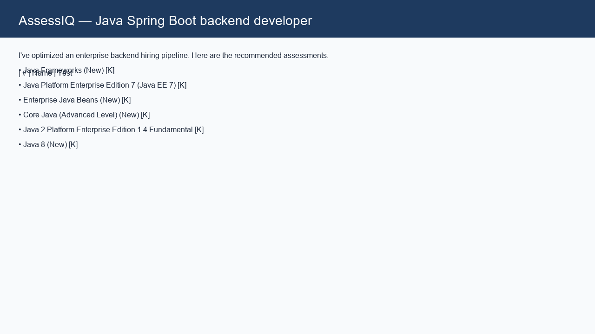
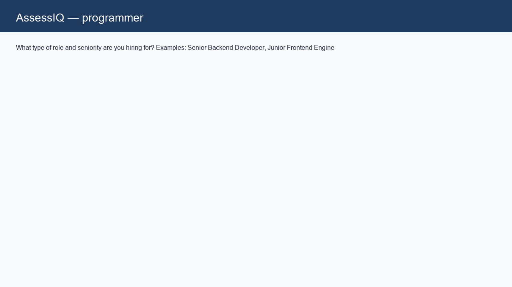
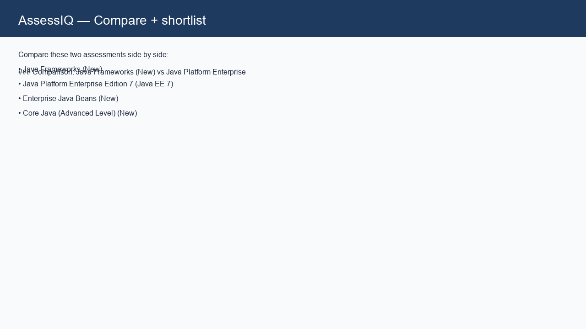

# AssessIQ

> Conversational SHL assessment recommender — SHL AI Intern take-home

[](https://www.python.org/)
[](https://fastapi.tiangolo.com/)
[](https://streamlit.io/)

**Live demo:** [assessiq-ai.streamlit.app](https://assessiq-ai.streamlit.app)  
**API:** [assessiq-nkp2.onrender.com](https://assessiq-nkp2.onrender.com) · [Docs](https://assessiq-nkp2.onrender.com/docs)  
**Design:** [APPROACH.md](APPROACH.md) (≤2 pages)

---

## Screenshots

| Landing | Recommendations | Clarify flow | Compare / export |
|:---:|:---:|:---:|:---:|
|  |  |  |  |

*Validation gates:* see [docs/screenshots/05-validation-gates.png](docs/screenshots/05-validation-gates.png)

---

## What it does

- Stateless `POST /chat` with full message history (no server-side memory)
- Clarify → recommend → refine → compare → refuse (SHL evaluator schema)
- 377 Individual Test Solutions, hybrid retrieval + domain-safe ranking
- Streamlit recruiter UI with exportable markdown report

---

## Quick start (local)

```bash
pip install -r requirements.txt
python -m uvicorn app.main:app --host 127.0.0.1 --port 8000
# separate terminal:
streamlit run frontend/streamlit_app.py
```

Set `BACKEND_URL=http://localhost:8000` for the frontend.

---

## Reviewer quick test (curl)

```bash
curl -s https://assessiq-nkp2.onrender.com/health

curl -s -X POST https://assessiq-nkp2.onrender.com/chat \
  -H "Content-Type: application/json" \
  -d '{"messages":[{"role":"user","content":"Java Spring Boot backend developer"}]}'

curl -s -X POST https://assessiq-nkp2.onrender.com/chat \
  -H "Content-Type: application/json" \
  -d '{"messages":[{"role":"user","content":"AI Engineer with Python and machine learning"}]}'

curl -s -X POST https://assessiq-nkp2.onrender.com/chat \
  -H "Content-Type: application/json" \
  -d '{"messages":[{"role":"user","content":"programmer"}]}'

curl -s -X POST https://assessiq-nkp2.onrender.com/chat \
  -H "Content-Type: application/json" \
  -d '{"messages":[{"role":"user","content":"What is the capital of France?"}]}'
```

---

## Validation

Run the full submission gate (local backend must be running ~45s for FAISS cold start):

```bash
python scripts/run_submission_readiness.py
```

**Latest gate results** (`artifacts/submission_readiness_report.md`): **READY TO SUBMIT**

| Gate | Result |
|------|--------|
| pytest | 50 passed |
| Evaluator suite | 15/15 |
| Acceptance probes | 43/43 |
| Comprehensive scenarios | 54/54 |
| UI curated scenarios | 30/30 |
| C1–C10 Recall@10 | 1.00 avg (all traces ≥ 0.80) |
| Production `/health` | OK |

Individual suites:

| Suite | Command |
|-------|---------|
| Unit tests | `python -m pytest tests/ -q` |
| Evaluator (15) | `python scripts/run_eval_suite.py` |
| Acceptance (43) | `python scratch/run_acceptance_tests.py` |
| Professions (54) | `python scripts/comprehensive_test_50.py` |
| UI scenarios (30) | `python scripts/run_curated_browser_validation.py` |
| C1–C10 recall | `python scripts/run_c1_c10_recall.py` |

Report: `artifacts/submission_readiness_report.md`

---

## API schema

```json
{
  "reply": "string",
  "recommendations": [{"name": "...", "url": "...", "test_type": "K"}],
  "end_of_conversation": false
}
```

Empty `recommendations` when clarifying or refusing. Max 8 turns, 30s timeout.

---

## Architecture

```
User → ConversationAnalyzer → DecisionEngine → HybridRetriever → Ranker
     → CatalogInjection → DomainFilter → HardEvalSafetyLayer → JSON
```

---

## Project structure

```
app/           FastAPI routes, ranker, retriever, decision engine
frontend/      Streamlit recruiter UI
scripts/       Eval harnesses + submission readiness
tests/         pytest regression
GenAI_SampleConversations/   Official C1–C10 traces
APPROACH.md    Design document (submission)
```

---

## Deployment

| Component | Platform | URL |
|-----------|----------|-----|
| Backend | Render | assessiq-nkp2.onrender.com |
| Frontend | Streamlit Cloud | assessiq-ai.streamlit.app |

Streamlit secret: `BACKEND_URL=https://assessiq-nkp2.onrender.com`

---

## Submission checklist (SHL PDF)

| Requirement | Evidence |
|-------------|----------|
| `GET /health` → `{"status":"ok"}` | Production URL above |
| Stateless `POST /chat` strict schema | `app/utils/hard_eval_safety.py` |
| Clarify / recommend / refine / compare | `decision_engine.py`, `chat.py` |
| Catalog-grounded URLs only | `catalog_loader` + validator |
| Approach doc ≤2 pages | [APPROACH.md](APPROACH.md) |

---

## License

MIT — see [LICENSE](LICENSE).
